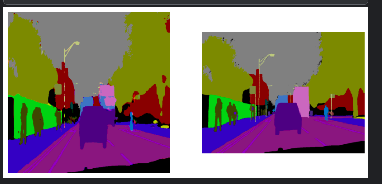

# UNet for Multiclass Segmentation

## Overview

This project implements a UNet architecture, a foundational model based on Convolutional Neural Networks (CNNs), for multiclass image segmentation. The goal is to accurately segment various entities within an image, such as persons, roads, cars, trucks, signals, walls, etc. Each entity in the image is identified and segmented into distinct classes, even when multiple objects are present.

## Problem Statement

The challenge is to develop a model capable of segmenting different objects within a single image. Given an input image, the model should distinguish and segment entities such as persons, vehicles, roads, and other elements, providing a comprehensive and detailed segmentation map.

## Approach

### UNet Architecture

UNet is one of the most influential architectures for image segmentation tasks. It has proven effective across various domains, from medical imaging to autonomous driving. In this project, the UNet architecture is developed from scratch and trained on a custom dataset to perform multiclass segmentation.

### Data Augmentation with Albumentations

To prevent overfitting and improve the model's generalization, the Albumentations library is utilized for data augmentation. Techniques such as random flipping and rotation are applied to the images during training, ensuring that the model sees a slightly different version of each image in every epoch.

### Training

The model was trained for approximately 180 epochs. Below, you can see the results on a sample test image. The image on the left represents the segmentation predicted by the model, while the image on the right is the ground truth segmentation.

### Results

